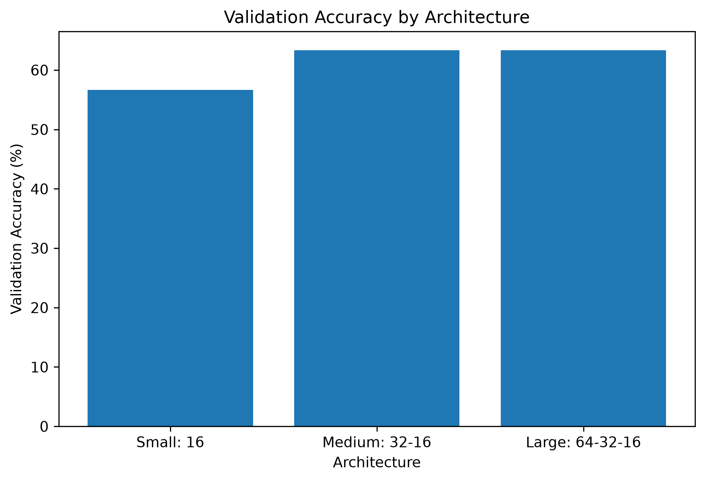
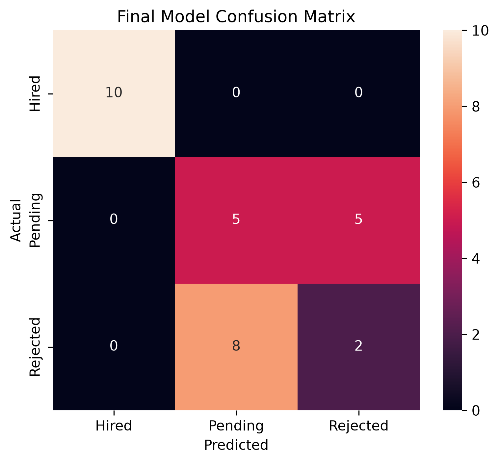
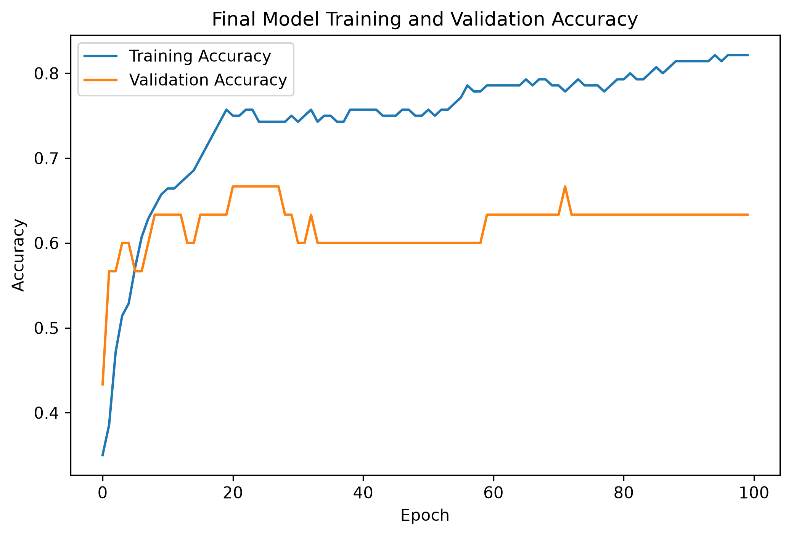
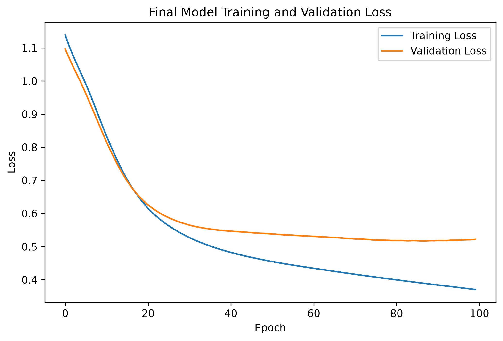

# Neural Network Classification for Recruitment Prediction

## Project Overview

This project was developed as part of a Data Science internship task focused on building a neural network for classification.

The objective was to predict a candidate's recruitment status using structured candidate information such as position, experience, technical score, and interview score.

The project also focused on:

* experimenting with multiple neural network architectures
* identifying and reducing overfitting
* applying regularization techniques
* performing hyperparameter optimization
* evaluating the final model using an untouched test dataset

## Problem Statement

The classification task predicts one of three recruitment outcomes:

* Hired
* Pending
* Rejected

The input features used were:

* Position
* Experience
* Tech_Score
* Interview

`Candidate_ID` was excluded because it is an identifier and does not represent a meaningful predictive feature.

## Dataset

The Recruitment dataset contains:

* 200 observations
* 6 original columns
* 4 predictive features
* 3 target classes

Target distribution:

* Rejected: 69
* Pending: 68
* Hired: 63

No missing values were identified in the dataset.

## Technologies Used

* Python
* Pandas
* NumPy
* Scikit-learn
* TensorFlow
* Keras
* Keras Tuner
* Matplotlib
* Seaborn
* Jupyter Notebook
* VS Code
* Git
* GitHub

## Project Workflow

The project followed the workflow below:

1. Data Understanding
2. Exploratory Data Analysis
3. Data Preprocessing
4. Train / Validation / Test Splitting
5. Feature Encoding and Scaling
6. Baseline Neural Network Development
7. Neural Network Architecture Experiments
8. Overfitting Analysis
9. Regularization Experiments
10. Hyperparameter Tuning
11. Final Model Selection
12. Test Set Evaluation
13. Error Analysis

## Data Preprocessing

The dataset was divided into:

* 70% Training
* 15% Validation
* 15% Testing

Stratified splitting was used to maintain a similar class distribution across the datasets.

Numerical features:

* Experience
* Tech_Score
* Interview

were standardized using `StandardScaler`.

The categorical feature:

* Position

was transformed using `OneHotEncoder`.

The preprocessing transformer was fitted only on the training data to reduce the risk of data leakage.

The target variable was encoded using `LabelEncoder`.

## Baseline Neural Network

The initial neural network architecture was:

```text
Input
  ↓
Dense 32 - ReLU
  ↓
Dense 16 - ReLU
  ↓
Dense 3 - Softmax
```

Training configuration:

* Optimizer: Adam
* Loss: Sparse Categorical Crossentropy
* Batch Size: 16
* Epochs: 100

Baseline results:

* Training Accuracy: 80.71%
* Validation Accuracy: 53.33%
* Training Loss: 0.3609
* Validation Loss: 0.5651

The difference between training and validation performance indicated overfitting.

## Architecture Experiments

Three architectures were compared.

| Architecture        | Training Accuracy | Validation Accuracy | Training Loss | Validation Loss |
| ------------------- | ----------------: | ------------------: | ------------: | --------------: |
| Small: 16           |            74.29% |              60.00% |          0.51 |            0.55 |
| Medium: 32 → 16     |            90.71% |              70.00% |          0.23 |            0.77 |
| Large: 64 → 32 → 16 |            94.29% |              60.00% |          0.17 |            0.77 |

The Medium architecture produced the highest validation accuracy.

The Large architecture achieved very high training accuracy but weaker validation performance, indicating stronger overfitting.



## Overfitting Prevention

The following techniques were evaluated:

* Early Stopping
* Dropout
* L2 Regularization

Results:

| Model                         | Training Accuracy | Validation Accuracy | Training Loss | Validation Loss |
| ----------------------------- | ----------------: | ------------------: | ------------: | --------------: |
| Medium Baseline               |            90.71% |              70.00% |          0.23 |            0.77 |
| Early Stopping                |            78.57% |              60.00% |          0.44 |            0.53 |
| Dropout + Early Stopping      |            75.71% |              60.00% |          0.48 |            0.50 |
| L2 + Dropout + Early Stopping |            72.86% |              53.33% |          0.54 |            0.57 |

Regularization reduced the difference between training and validation performance and lowered validation loss.

However, stronger regularization also reduced classification accuracy, suggesting that excessive regularization caused underfitting on this relatively small dataset.

## Hyperparameter Tuning

Keras Tuner Random Search was used to explore combinations of:

* hidden layer size
* number of hidden layers
* dropout rate
* learning rate

The best hyperparameters found were:

```text
First Hidden Layer: 32 neurons
First Dropout Rate: 0.0
Number of Hidden Layers: 2
Learning Rate: 0.001
```

Comparison:

| Model                | Training Accuracy | Validation Accuracy | Training Loss | Validation Loss |
| -------------------- | ----------------: | ------------------: | ------------: | --------------: |
| Medium Baseline      |            90.71% |              70.00% |          0.23 |            0.77 |
| Tuned Neural Network |            81.43% |              56.67% |          0.40 |            0.53 |

Hyperparameter tuning reduced validation loss but did not improve validation accuracy.

Therefore, the manually defined Medium architecture remained the strongest model based on validation classification accuracy.

## Final Model

Selected architecture:

```text
Input
  ↓
Dense 32 - ReLU
  ↓
Dense 16 - ReLU
  ↓
Dense 3 - Softmax
```

The model was evaluated once on the previously untouched test dataset.

### Final Test Results

* Accuracy: 53.33%
* Precision: 52.78%
* Recall: 53.33%
* F1 Score: 52.86%
* Test Loss: 0.6690

## Classification Performance

The final test dataset contained 30 observations.

### Hired

* Precision: 1.00
* Recall: 1.00
* F1 Score: 1.00
* Support: 10

### Pending

* Precision: 0.33
* Recall: 0.40
* F1 Score: 0.36
* Support: 10

### Rejected

* Precision: 0.25
* Recall: 0.20
* F1 Score: 0.22
* Support: 10

The model successfully classified all Hired candidates in the test set.

Most errors occurred between the Pending and Rejected classes.



## Error Analysis

The confusion matrix showed that:

* all 10 Hired candidates were classified correctly
* 4 of 10 Pending candidates were classified correctly
* 6 Pending candidates were incorrectly classified as Rejected
* 2 of 10 Rejected candidates were classified correctly
* 8 Rejected candidates were incorrectly classified as Pending

This suggests that the current features provide stronger information for identifying Hired candidates than for distinguishing between Pending and Rejected candidates.

Additional recruitment-related features may therefore be required to improve separation between these two classes.

## Training Curves

### Accuracy



### Loss



## Limitations

The main limitation of this project is the relatively small dataset containing only 200 observations.

The final test set therefore contained only 30 observations, meaning that a small number of incorrect predictions can substantially affect the reported performance.

The available predictor variables are also limited to:

* Position
* Experience
* Technical Score
* Interview Score

Additional features may improve the ability to distinguish Pending and Rejected candidates.

## Future Improvements

Future work should consider:

* validating the model using a larger independent dataset
* collecting additional recruitment-related features
* increasing the number of training observations
* exploring additional feature engineering techniques
* conducting more extensive hyperparameter optimization
* comparing neural networks with traditional machine learning models
* evaluating alternative sampling and validation strategies

## Project Structure

```text
neural-network-classification/
│
├── data/
│   └── Datasets.xlsx
│
├── notebooks/
│   ├── 01_data_understanding.ipynb
│   ├── 02_data_preprocessing.ipynb
│   ├── 03_neural_network_baseline.ipynb
│   ├── 04_architecture_experiments.ipynb
│   ├── 05_overfitting_prevention.ipynb
│   ├── 06_hyperparameter_tuning.ipynb
│   └── 07_final_model_evaluation.ipynb
│
├── models/
│   ├── recruitment_classifier.keras
│   ├── preprocessor.pkl
│   └── label_encoder.pkl
│
├── results/
│   ├── target_distribution.png
│   ├── architecture_comparison.png
│   ├── final_confusion_matrix.png
│   ├── final_accuracy_curve.png
│   └── final_loss_curve.png
│
├── report/
├── requirements.txt
├── .gitignore
└── README.md
```

## Key Conclusion

The experiments demonstrated that increasing neural network complexity improved training performance but did not necessarily improve generalization.

Regularization and hyperparameter optimization reduced overfitting in several experiments, but the Medium `32 → 16` architecture achieved the highest validation classification accuracy.

Final test evaluation revealed strong performance for the Hired class but significant confusion between Pending and Rejected candidates.

The results highlight the importance of model validation, architecture comparison, overfitting control, hyperparameter optimization, and independent test evaluation when developing neural network classification systems.
